<p align="center">
  
</p>

# 🩺 AI Medical Assistant
<h3 align="center">
Intelligent Healthcare Prediction & Conversational AI Platform
</h3>

<p align="center">


</p>
AI Medical Assistant is a Machine Learning powered healthcare web application that predicts diseases based on user-selected symptoms.
The application combines Flask, Scikit-learn, SQLite, HTML, CSS and JavaScript to deliver disease prediction, AI-powered health assistance, downloadable medical reports and healthcare analytics through an intuitive web interface.


## Table of Contents

- [Project Objectives](#project-objectives)
- [Project Overview](#project-overview)
- [Features](#features)
- [Project Demo](#project-demo)
- [Application Workflow](#application-workflow)
- [System Architecture](#system-architecture)
- [Application Screenshots](#application-screenshots)
- [Dataset](#dataset)
- [Machine Learning Pipeline](#machine-learning-pipeline)
- [Machine Learning Models](#machine-learning-models)
- [Final Model Selection](#final-model-selection)
- [Healthcare Dashboard](#healthcare-dashboard)
- [AI Medical Assistant](#ai-medical-assistant)
- [Technology Stack](#technology-stack)
- [Project Structure](#project-structure)
- [Installation](#installation)
- [Model Evaluation](#model-evaluation)
- [Results](#results)
- [Future Improvements](#future-improvements)
- [Why This Project?](#why-this-project)
- [Medical Disclaimer](#medical-disclaimer)
- [Developer](#developer)
- [License](#license)

# Project Objectives

The main objectives of this project are:

- Build an intelligent symptom-based disease prediction system.
- Compare multiple Machine Learning algorithms.
- Select and deploy the best-performing model.
- Develop a complete AI-powered healthcare application using Flask.
- Generate AI-assisted medical reports with confidence scores.

# Project Overview

AI Medical Assistant is a full-stack Machine Learning healthcare web application that predicts diseases based on user-selected symptoms.

The system integrates Machine Learning, Flask, SQLite, and an interactive web interface to provide intelligent disease prediction, downloadable medical reports, health analytics, and an AI-powered medical assistant.

This project demonstrates the complete AI development lifecycle—from data preprocessing and model training to deployment in a real-world healthcare application.

##  Features

- Secure User Authentication
- Disease Prediction using Machine Learning
- Confidence Score Generation
- Medical Report Generation
- PDF Download
- Previous Reports History
- Health Analytics Dashboard
- AI Medical Assistant Chatbot
- SQLite Database Integration

# 🎥 Project Demo

<p align="center">
Click the image above to watch the complete demonstration.
</p>

https://www.youtube.com/watch?v=wUH74Kr6yi4


#  Application Workflow
The application provides a complete healthcare workflow:


<p align="center">
  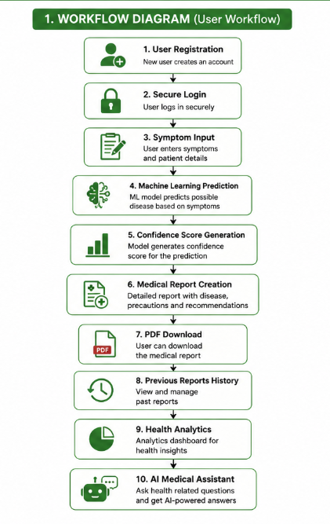
</p>

---

#  System Architecture

<p align="center">
  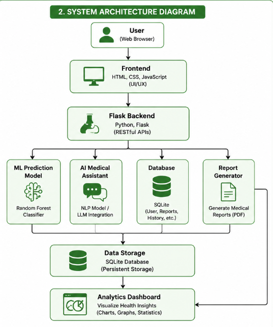
</p>

---


# 📸 Application Screenshots


##  Dashboard 

<p align="center">
  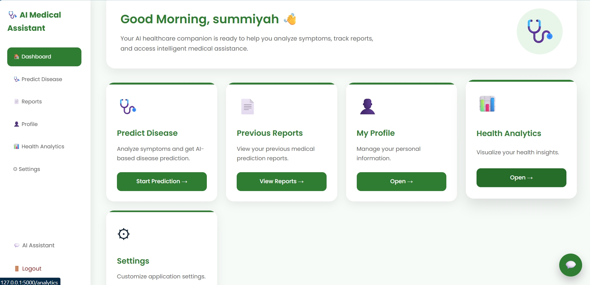
</p>

---

##  Disease Prediction

<p align="center">
  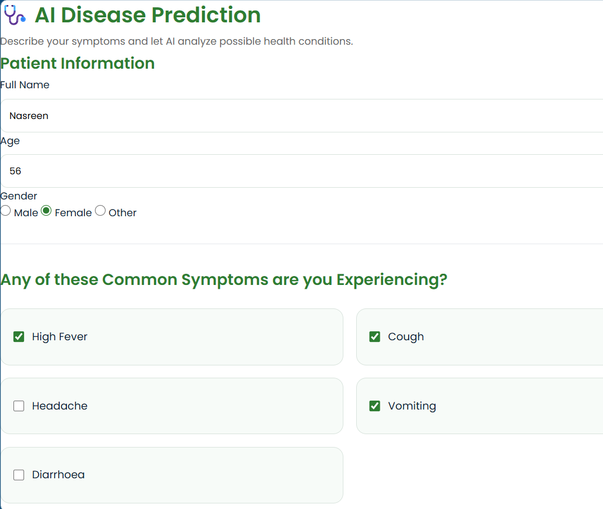
  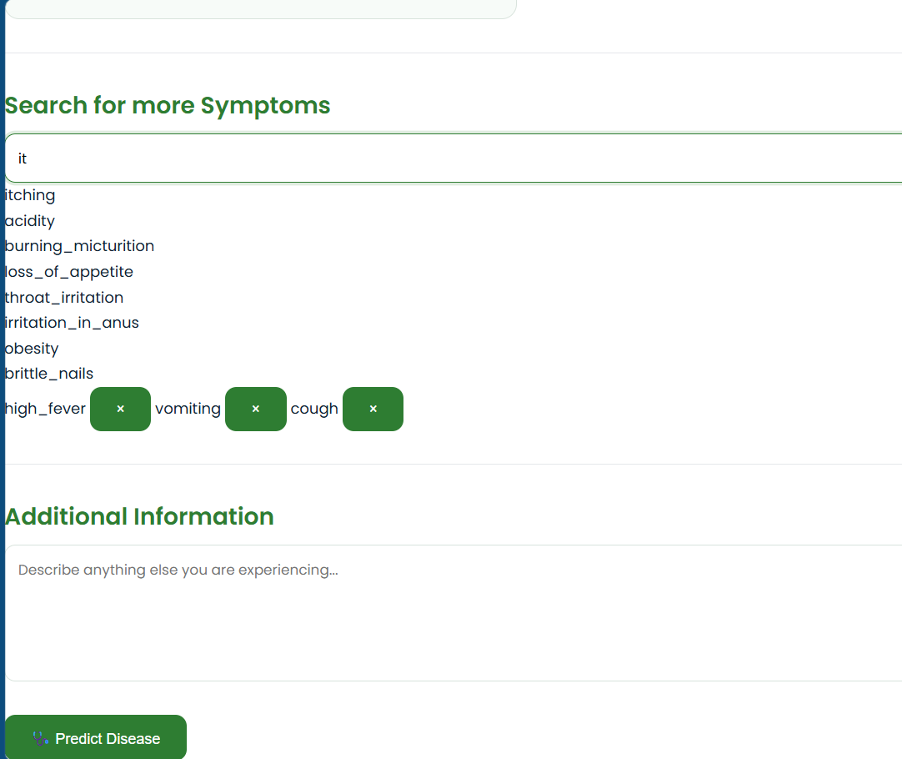
</p>

---

##  Medical Report

<p align="center">
  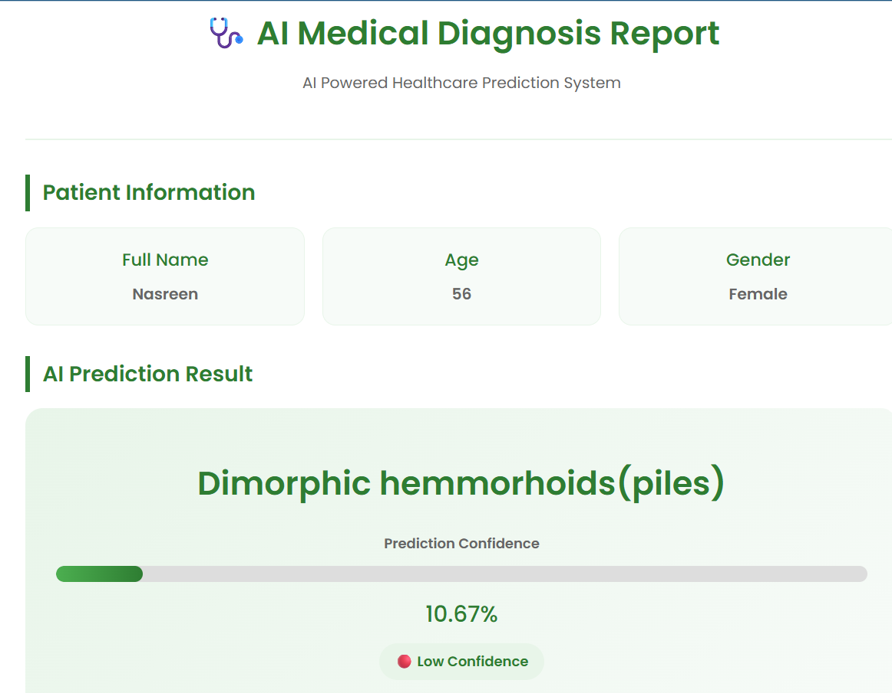
  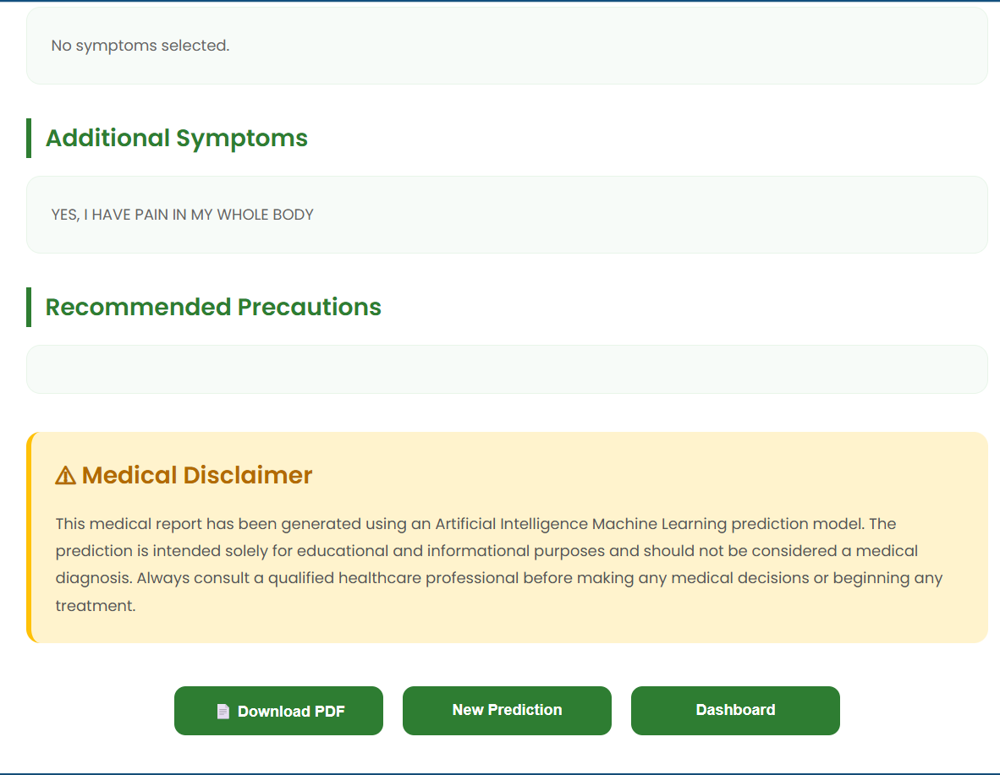
</p>

---

##  Health Analytics & Previous Reports

<p align="center">
  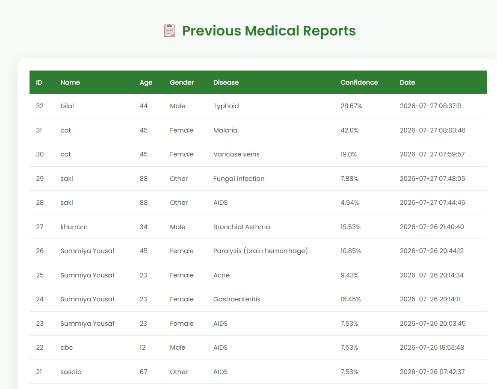
  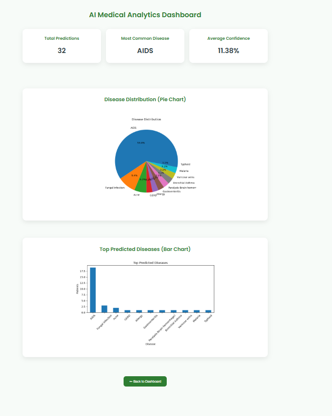
</p>

---

##  Settings & AI Assistant

<p align="center">
  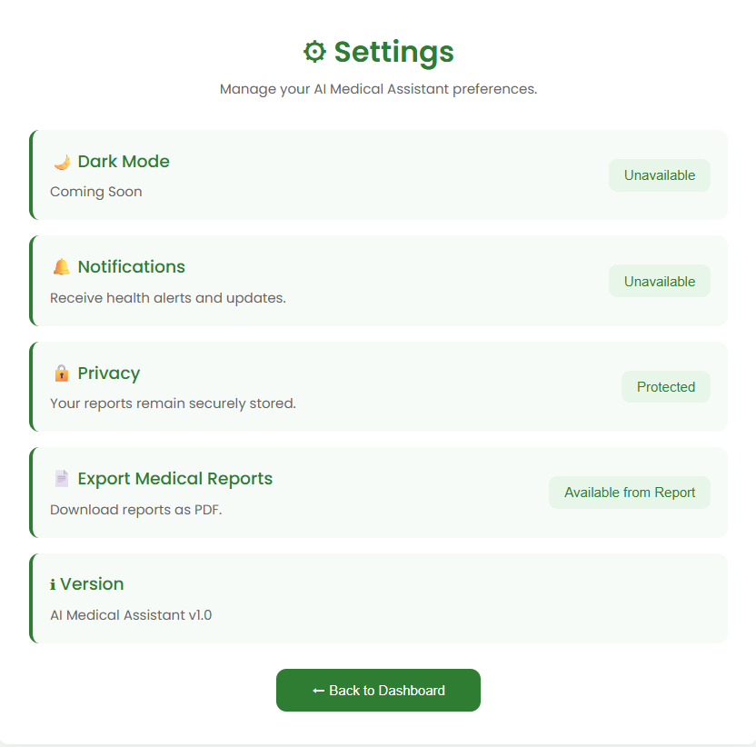
  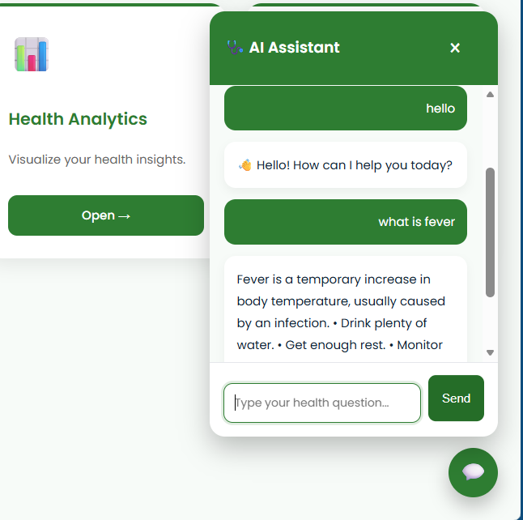
</p>


##  Dataset

The model was trained using a disease-symptom dataset containing:

- 132 symptoms
- 41 diseases
- Binary symptom encoding
- Training and testing datasets

Dataset files:
```bash

dataset/
├── Training.csv
└── Testing.csv
   ```       

# Machine Learning Pipeline


## 1. Data Loading

Dataset is loaded using:

- Pandas
- NumPy


## 2. Exploratory Data Analysis


Performed analysis:

- Dataset structure inspection
- Missing value checking
- Duplicate detection
- Disease distribution analysis
- Symptom analysis


Visualization tools:

- Matplotlib
- Seaborn


## 3. Feature Engineering


Symptoms are converted into numerical vectors.

Example:

The model receives a 132-dimensional feature vector and are converted into numerical values using label encoding.


# Machine Learning Models


Multiple classification algorithms were trained and evaluated:


| Model         | Accuracy |
| ------------- | -------- |
| Decision Tree | 98%      |
| Random Forest | 99%      |
| Naive Bayes   | 97%      |
| SVM           | 98%      |


Evaluation metrics:


- Accuracy
- Precision
- Recall
- F1 Score
- Confusion Matrix


#  Final Model Selection


After evaluating different algorithms, the final deployed model selected was:


##  Random Forest Classifier


Reasons for selection:


✅ Handles complex symptom relationships  
✅ Better generalization capability  
✅ Reduces overfitting compared to individual decision trees  
✅ Works efficiently with structured medical datasets  
✅ Provides probability estimates for predictions  


Saved model:
```bash
models/
└── best_model.pkl
```


##  Healthcare Dashboard


A professional dashboard that provides users with centralized access to all healthcare services.


- User-friendly navigation
- Disease prediction access
- Medical reports
- Health analytics
- Profile management
- Settings


#  Disease Prediction Module


Generated report contains:


- Patient information
- Predicted disease
- Confidence level
- Selected symptoms
- Input vector information


#  AI Medical Assistant


The application includes an interactive AI assistant.


Features:


- Floating chatbot interface
- Real-time conversation
- Health-related questions
- User-friendly chat experience
- Responsive design


---

#  Technology Stack

| Category      | Technologies          |
| ------------- | --------------------- |
| Language      | Python                |
| Backend       | Flask                 |
| ML            | Scikit-learn          |
| Database      | SQLite                |
| Frontend      | HTML, CSS, JavaScript |
| Visualization | Matplotlib, Seaborn   |


---

# Project Structure

```bash

AI_Medical_Assistant/
│
├── app.py                      # Main Flask application
├── database.py                 # SQLite database configuration
├── requirements.txt            # Project dependencies
├── README.md                   # Project documentation
├── .gitignore
│
├── dataset/
│   ├── Training.csv
│   └── Testing.csv
│
├── data/
│   ├── disease_descriptions.json
│   ├── disease_precautions.json
│   ├── disease_medications.json
│   ├── disease_specialists.json
│   ├── disease_symptoms.json
│   ├── disease_general_advice.json
│   ├── emergency_disease.json
│   ├── recommended_hospitals.json
│   └── risk_levels.json
│
├── docs/
│   └── screenshots/
│       ├── workflow.png
│       ├── architecture.png
│       ├── dashboard.png
│       ├── predict1.png
│       ├── predict2.png
│       ├── report1.png
│       ├── report2.png
│       ├── analytics.png
│       ├── previousreports.png
│       ├── settings.png
│       └── assistant.png
│
├── models/
│   ├── best_model.pkl
│   ├── label_encoder.pkl
│   ├── decision_tree_model.pkl
│   ├── random_forest_model.pkl
│   ├── naive_bayes_model.pkl
│   └── svm_model.pkl
│
├── reports/                    # Generated medical reports
│
├── src/
│   ├── __init__.py
│   ├── data_loader.py
│   ├── eda.py
│   ├── preprocess.py
│   ├── train.py
│   ├── evaluate.py
│   ├── predict.py
│   ├── report.py
│   └── symptom_aliases.py
│
├── static/
│   ├── css/
│   ├── js/
│   ├── charts/
│   └── images/
│
└── templates/
    ├── dashboard.html
    ├── login.html
    ├── signup.html
    ├── predict.html
    ├── report.html
    ├── previousreports.html
    ├── analytics.html
    ├── assistant.html
    ├── profile.html
    ├── settings.html
    ├── edit_profile.html
    ├── logout.html
    └── logout_success.html
```

##  Installation

Clone the repository

```bash
git clone https://github.com/summiyahyousaf/AI_Medical_Assistant.git
```

Navigate into the project

```bash
cd AI_Medical_Assistant
```

Create virtual environment

```bash
python -m venv venv
```

Activate virtual environment

Windows

```bash
venv\Scripts\activate
```

Install dependencies

```bash
pip install -r requirements.txt
```

Run the application

```bash
python app.py
```

Open:

```
http://127.0.0.1:5000
```
#  Model Evaluation

The system generates:

Accuracy comparison graph
Confusion matrices
Classification reports

## Evaluation metrics:
Accuracy

Precision

Recall

F1 Score

##  Results

- Achieved approximately **99% prediction accuracy** using the Random Forest classifier.
- Successfully deployed the trained model using Flask.
- Generates confidence scores for every prediction.
- Stores reports in SQLite.
- Supports PDF report generation.
- Includes an AI-powered medical assistant.

# Future Improvements:

- Artificial Intelligence Improvements
- Deep Learning disease prediction
- Neural network-based classification
- Large Language Model healthcare assistant
- Explainable AI integration
- Healthcare Features
- Voice-based medical assistant
- Medical document analysis
- Personalized health recommendations
- Doctor recommendation system
- Appointment management


##  Why This Project?

This project was developed to explore how Artificial Intelligence and Machine Learning can improve healthcare accessibility by assisting users in understanding symptoms and generating informative health reports through an interactive web application.

It also demonstrates practical implementation of Machine Learning model deployment using Flask and serves as a portfolio project showcasing end-to-end AI application development.


## ⚠️ Medical Disclaimer

This application is developed for educational and research purposes only.
The predictions generated by this system should not replace professional medical advice, diagnosis, or treatment.
Always consult qualified healthcare professionals for medical decisions.


##  Developer

**Summiya Yousaf**

Bachelor of Science in Artificial Intelligence

Air University Islamabad

### Interests

- Artificial Intelligence
- Machine Learning
- Healthcare AI
- NLP
- Computer Vision

### 🔗 Connect with me

- GitHub: https://github.com/summiyahyousaf
- LinkedIn: https://www.linkedin.com/in/summiya-yousaf-24411534a/
  
 ##  License

This project is licensed under the MIT License.


⭐ If you found this project interesting, consider giving it a star!
